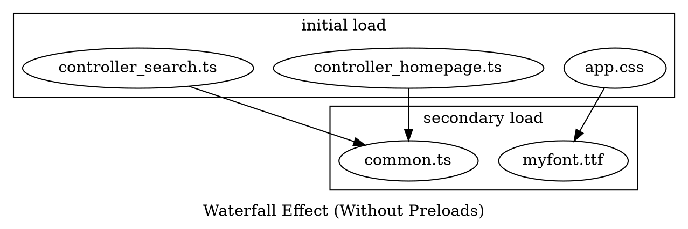

# Preloading Assets

Now that we're familiar with 
{{docs/features/asset-bundling-esbuild/accessing-entrypoints-in-php}} and 
{{docs/features/asset-bundling-esbuild/cache-busting}}, let's leverage these 
features to preload assets effectively, reducing front-end loading times.

## Understanding the Waterfall Issue

Consider a project structure like this:

```
resources/
├─ css/
│  ├─ app.css
├─ ts/
│  ├─ controller_homepage.ts
│  ├─ controller_search.ts
│  ├─ common.ts
├─ fonts/
│  ├─ myfont.ttf
```

This code relies on `myfont.ttf` which is used by `app.css`. Additionally, both 
`controller_homepage.ts` and `controller_search.ts` utilize the same 
`common.ts` file. If you build these TypeScript files with eslint and the 
`--splitting` option, they will produce a common chunk of code.

However, it's important to note that browsers need to be made aware of this 
beforehand. As a result, they load some assets sequentially, creating a 
waterfall effect. For example, if you have a homepage with this structure:

```php-template
<!DOCTYPE html>
<html>
<head>
    <link rel="stylesheet" href="<?= $entryPoints->resolveEntryPointPath("app.css") ?>>
    <script src="<?= $entryPoints->resolveEntryPointPath("controller_homepage.ts") ?>" type="module"></script>
    <script src="<?= $entryPoints->resolveEntryPointPath("controller_search.ts") ?>" type="module"></script>
</head>
<body>
    <!-- homepage contents -->
</body>
</html>
```



The browser will load three entrypoints first:

- `app.css`
- `controller_homepage.ts`
- `controller_search.ts`

After loading these, it will discover that `app.css` needs to load 
`myfont.ttf`, and both scripts require the common chunk from `common.ts`. 
Only after loading the initial resources will it begin loading the additional 
files:

- `myfont.ttf`
- `common.ts`

To mitigate this issue, we can inform the browser upfront about all the 
resources it needs to load for the page, allowing it to load everything in 
parallel.

## PHP Templates

### Building Meta-Preloads

Each time an entry point path is resolved (which means that the PHP converted
input entry point name to the target filename that is embeddable in the 
application), the `EsbuildMetaEntryPoints` also 
learns about its imported resources by reading them from the esbuild metafile.

To collect the imports data, you should first resolve your resources' paths. 
Then, you can use the `EsbuildPreloadablesIterator` to iterate over preloadable 
values:

```php-template
<?php

/**
 * @var Resonance\EsbuildMetaEntryPoints $entryPoints
 */
$stylesheetHref = $entryPoints->resolveEntryPointPath("app.css");
$homepageControllerHref = $entryPoints->resolveEntryPointPath("controller_homepage.ts");
$searchControllerHref = $entryPoints->resolveEntryPointPath("controller_search.ts");

?>
<!DOCTYPE html>
<html>
<head>
    <?php foreach(new EsbuildPreloadablesIterator($entryPoints) as $preloadable): ?>
    <?= 
        sprintf(
            match ($preloadable->type) {
                EsbuildPreloadableType::Font => '<link rel="preload" as="font" crossorigin href="%s">',
                EsbuildPreloadableType::JavaScriptModule => '<link rel="modulepreload" href="%s">',
            },
            $preloadable->pathname,
        ) 
    ?>
    <?php endforeach ?>
    <link rel="stylesheet" href="<?= $stylesheetHref ?>>
    <script src="<?= $homepageControllerHref ?>" type="module"></script>
    <script src="<?= $searchControllerHref ?>" type="module"></script>
</head>
<body>
    <!-- homepage contents -->
</body>
</html>
```

### Using the Built-In Renderer

You can also utilize the built-in renderer to generate preload meta-tags. 
It produces an HTML string with a series of `<link rel="preload">` tags:

```php-template
<?php

use Distantmagic\Resonance\EsbuildMetaPreloadsRenderer;
use Distantmagic\Resonance\TemplateFilters;

// (...)

$templateFilters = new TemplateFilters();

?>
<!DOCTYPE html>
<html>
<head>
    <?= new EsbuildMetaPreloadsRenderer($entryPoints, $templateFilters) ?>
    <link rel="stylesheet" href="<?= $stylesheetHref ?>>
    <script src="<?= $homepageControllerHref ?>" type="module"></script>
    <script src="<?= $searchControllerHref ?>" type="module"></script>
</head>
<body>
    <!-- homepage contents -->
</body>
</html>
```

## Twig

{{docs/features/templating/twig}} is bundled with a bridge layer between itself
and the Resonance framework.

To preload assets first, you need to use either `esbuild` or `esbuild_preload`
function that is built into Resonance's Twig extension. Then you must render
the `<link rel="preload">` tags. You can do so either manually (similar to the
PHP version) or by using `esbuild_render_preloads`. For example:

```twig
{{ esbuild_preload(request, 'worker_baz.ts') }}
{{ esbuild_preload(request, 'worker_booz.ts') }}

<script defer type="module" src="{{ esbuild(request, 'controller_foo.ts') }}"></script>
<script defer type="module" src="{{ esbuild(request, 'controller_bar.ts') }}"></script>

{{ esbuild_render_preloads(request) }}
```

If you want to put preloads before the scripts, you can save them into the 
Twig's variable first:

```twig
{{ esbuild_preload(request, 'worker_baz.ts') }}
{{ esbuild_preload(request, 'worker_booz.ts') }}


    <script defer type="module" src="{{ esbuild(request, 'controller_foo.ts') }}"></script>
    <script defer type="module" src="{{ esbuild(request, 'controller_bar.ts') }}"></script>


{{ esbuild_render_preloads(request) }}
{{ assets|raw }}
```
