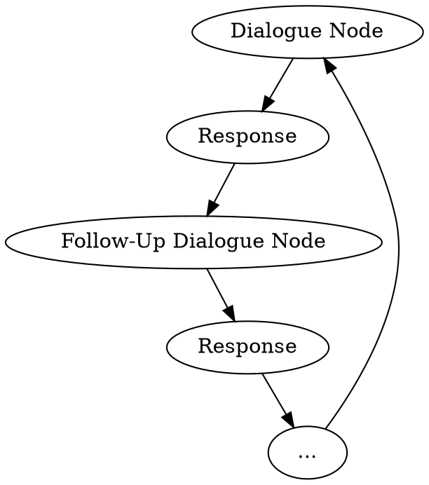
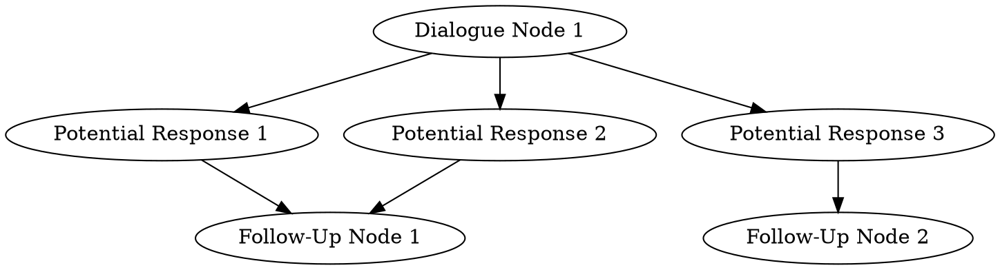

# Dialogue Nodes

## Conversation Flow

The general conversation flow starts with a dialogue node, which has a list of
potential responses. 

When a user selects a potential response (it's up to the application to 
determine how the user selects a response - it can be typing, clicking, or 
really any other way) it is followed up with some message and then the next 
dialogue node.

The process goes on until the follow-up node returns `null` as the next 
dialogue node.



Multiple conversation options can point to the same dialogue node:



## Usage

### Literal Inputs

Let's say we need to implement a simple dialogue:

```
System: 
    Message: Hello! What do you want to do today?
    Potential Responses:
        - I want to play a game.
        - I want to learn something new.
        - I want to do nothing.

User: I want to play a game.

System: 
    Message: Great! What game do you want to play?
    Potential Responses:
        - Chess.
        - Poker.
        - Tic-Tac-Toe.

User: Chess.
```

Let's start with an initial dialogue node:

```php
use Distantmagic\Resonance\DialogueNode;
use Distantmagic\Resonance\LiteralInputResponse;

$gameFollowUpNode = DialogueNode::withMessage('Great! What game do you want to play?');
$gameFollowUpNode->addPotentialResponse(new LiteralInputResponse(when: 'Chess.', followUp: null));
$gameFollowUpNode->addPotentialResponse(new LiteralInputResponse(when: 'Poker.', followUp: null));
$gameFollowUpNode->addPotentialResponse(new LiteralInputResponse(when: 'Tic-Tac-Toe.', followUp: null));

$playGameResponse = new LiteralInputResponse(
    when: 'I want to play a game.',
    followUp: $gameFollowUpNode,
);

$initialNode = DialogueNode::withMessage('Hello! What do you want to do today?');
$initialNode->addPotentialResponse($playGameResponse);
```

### Fuzzy Inputs

:::note
To use this feature we need 
{{docs/features/ai/server/llama-cpp/extractors/when/index}}
extractor and a configured {{docs/features/ai/server/llama-cpp/index}} server.
:::

Let's say we want to implement a dialogue with a fuzzy input that covers 
wide range of responses that do not have to be defined upfront:

```
System: 
    Message: Hello! What do you want to play today?
    Potential Responses:
        - Board games.
        - Sports games.

User: I want to play basketball.

System: 
    Message: Great! Let's play sports.
```

```php
use Distantmagic\Resonance\DialogueInput\UserInput;
use Distantmagic\Resonance\DialogueNode;
use Distantmagic\Resonance\DialogueResponse\CatchAllResponse;
use Distantmagic\Resonance\DialogueResponse\LlamaCppExtractWhenResponse;
use Distantmagic\Resonance\DialogueResponseResolutionStatus;
use Distantmagic\Resonance\LlamaCppExtractWhenInterface;
use Distantmagic\Resonance\LlamaCppExtractWhenResult;

$initialNode = DialogueNode::withMessage('Hello! What do you want to play today?');

$initialNode->addPotentialResponse(new LlamaCppExtractWhenResponse(
    llamaCppExtractWhen: $llamaCppExtractWhen,
    condition: 'User says they want to play a board game',
    followUp: function (LlamaCppExtractWhenResult $result) {
        return new DialogueResponseResolution(
            followUp: DialogueNode::withMessage("Great! Let's play board games."),
            status: DialogueResponseResolutionStatus::CanRespond,
        );
    },
));

$initialNode->addPotentialResponse(new LlamaCppExtractWhenResponse(
    llamaCppExtractWhen: $llamaCppExtractWhen,
    condition: 'User says they want to play sports',
    followUp: function (LlamaCppExtractWhenResult $result) {
        return new DialogueResponseResolution(
            followUp: DialogueNode::withMessage("Great! Let's play sports."),
            status: DialogueResponseResolutionStatus::CanRespond,
        );
    },
));

$initialNode->addPotentialResponse(new CatchAllResponse(
    followUp: DialogueNode::withMessage("Sorry, I can't play that."),
));

$initialNode->respondTo(new UserInput('I want to play basketball.'));
```

## Creating Side Effects

Sometimes, you might want to react to specific user inputs or reuse the 
information provided by the user in a way that is not related to the dialogue
itself.

For example, users might provide the name of the application they want to create
or a name of an entity they intend to create, and you can follow up on that by
creating a background task.

First, we need to create a side-effect class:

```php
use Distantmagic\Resonance\DialogueNodeSideEffect;

readonly class ChangeUsername extends DialogueNodeSideEffect
{
    public function __construct(
        public string $username,
    ) {}
}
```

Side effects can be attached to the follow-up nodes:

```php
use Distantmagic\Resonance\DialogueInput\UserInput;
use Distantmagic\Resonance\DialogueNode;
use Distantmagic\Resonance\DialogueResponse\CatchAllResponse;
use Distantmagic\Resonance\DialogueResponse\LlamaCppExtractSubjectResponse;
use Distantmagic\Resonance\DialogueResponseResolution;
use Distantmagic\Resonance\LlamaCppExtractSubjectResult;

$initialNode = DialogueNode::withMessage('Hello! How can I help you today?');

$initialNode->addPotentialResponse(new LlamaCppExtractSubjectResponse(
    llamaCppExtractSubject: $llamaCppExtractSubject,
    topic: 'changing the username',
    whenProvided: function (LlamaCppExtractSubjectResult $result) {
        $username = $response->content;

        $followUp = DialogueNode::withMessage("Ok, let us set your username to: $username.");
        $followUp->addSideEffect(new ChangeUsername($username));

        return DialogueResponseResolution::canRespond($followUp);
    },
));

$initialNode->addPotentialResponse(new CatchAllResponse(
    followUp: DialogueNode::withMessage("Sorry, I can't help you with that."),
));

$response = $initialNode->respondTo(new UserInput('I want to change my username to foo_bar.'));

foreach ($response->getFollowUp()?->getSideEffects() as $sideEffect) {
    if ($sideEffect instanceof ChangeUsername) {
        // change the username somehow...
    }
}
```
