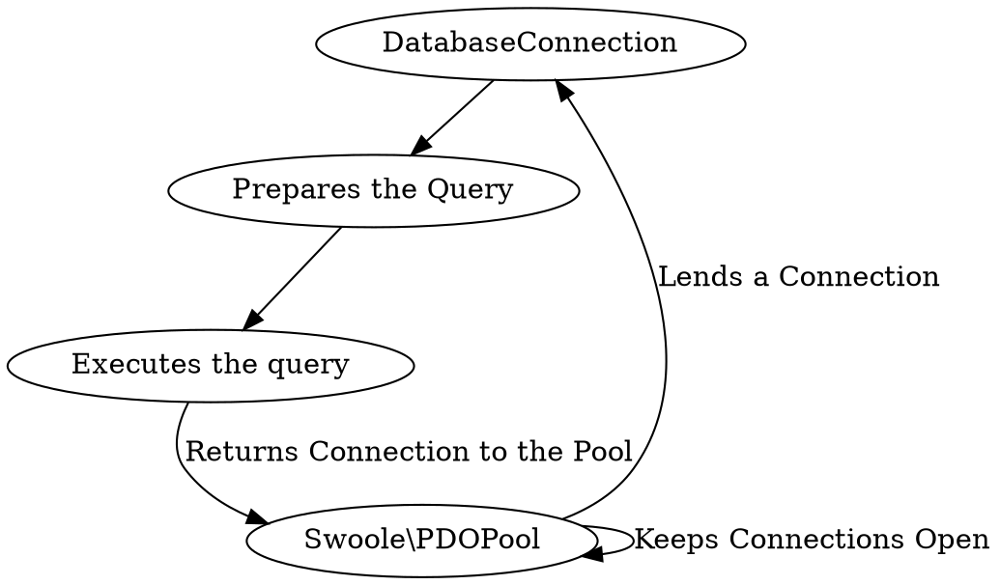

---
collections:
    - name: documents
      next: docs/features/database/reusing-database-queries
layout: dm:document
next: docs/features/database/reusing-database-queries
parent: docs/features/database/index
title: Database Queries
description: >
    Use database queries with Swoole's connection pools.
---

# Database Queries

:::caution
Not all versions of Swoole support all PDO drivers.

[Swoole 5.1.0](https://github.com/swoole/swoole-src/releases/tag/v5.1.0)
added support for PostgreSQL, ODBC, OCI, and SQLite. Before that version, it 
only supported the MySQL driver. 

If you are using an incorrect Swoole version (that does not 
support your driver), then database connections will be blocking (synchronous).
:::

## Querying the Database



`DatabaseConnection` wrapper takes a connection from Swoole's `PDO` 
connection pool, and after the query execution, it puts that connection back
into the pool.

`DatabaseConnection` objects are single-use. After executing your query, you 
have to create a new object if you want to repeat it.

```php
<?php

use Distantmagic\Resonance\DatabaseConnection;
use Distantmagic\Resonance\DatabaseConnectionPoolRepository;

/**
 * DatabaseConnection grabs one connection from the PDO Pool
 * 
 * @var DatabaseConnectionPoolRepository $databaseConnectionPoolRepository
 */
$conn = new DatabaseConnection($databaseConnectionPoolRepository);

// After returning, when $conn is destroyed by the Garbage Collector
// database connection is returned back to the pool
$conn->prepare('SELECT 2 + 2')->execute()->first();
```

## Using Specific Connection Pool

If you are using multiple connection pools, you need to point out which 
connection pool you want to use to make the query. For example, if you're 
going to use `"readonly"` connection pool:

```php
<?php

use Distantmagic\Resonance\DatabaseConnection;
use Distantmagic\Resonance\DatabaseConnectionPoolRepository;

$conn = new DatabaseConnection($databaseConnectionPoolRepository, 'readonly');
```

## Binding Values to Query Parameters

You can use `bindValue` almost the same way it's used with vanilla PHP
[PDOStatement::bindValue](https://www.php.net/manual/en/pdostatement.bindvalue.php).

The primary difference is the Resonance's `bindValue` is chainable:

```php
<?php

use Distantmagic\Resonance\DatabaseConnection;
use Distantmagic\Resonance\DatabaseConnectionPoolRepository;
use Swoole\Database\PDOPool;

/**
 * DatabaseConnection grabs one connection from the PDO Pool
 * 
 * @var DatabaseConnectionPoolRepository $databaseConnectionPoolRepository
 */
$conn = new DatabaseConnection($databaseConnectionPoolRepository);
$conn
    ->prepare(<<<'SQL'
        INSERT INTO blog_posts
        (
            content,
            title
        )
        VALUES
        (
            :content,
            :title
        )
    SQL)
    ->bindValue('content', 'blog post content')
    ->bindValue('title', 'blog post title')
    ->execute()
;
```

## Logging Queries

Queries emit the `SQLQueryBeforeExecute` event with the SQL code that
is about to be executed. It's possible to use this event to log queries (for
example, to the console output).

You can learn more about {{docs/features/events/index}} on their documentation
page.
