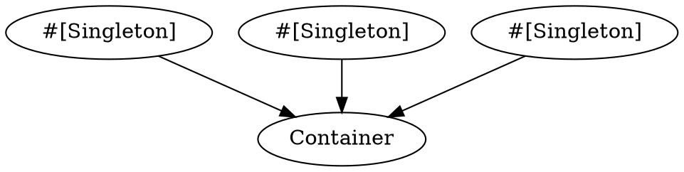
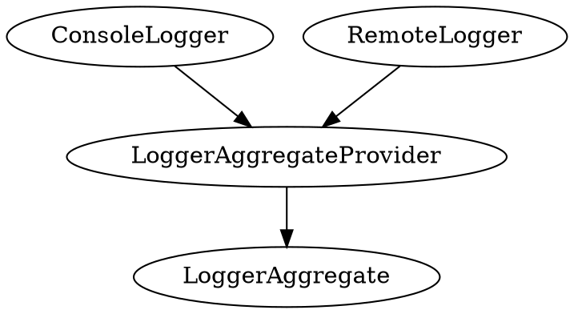
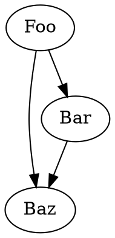

# Dependency Injection

Container manages objects with the use of attributes. It indexes your project 
files and extracts classes with the `Singleton` attribute. Then, it uses 
constructor arguments to build and inject all the singletons.

Container constructs Singletons lazily, meaning it will only construct them 
once some other class uses them as a constructor dependency. 

# Usage

## Building the Container

By default, Resonance comes with the predefined `bin/resonance.php` file which
initializes the container and your {{docs/features/console/index}} commands.

You can modify this file the way you need. By default, it scans your 
application's files and the base Resonance framework files to search for the
classes with the `#[Singleton]` attribute:

```php file:bin/resonance.php
<?php

namespace App;

use Distantmagic\Resonance\ConsoleApplication;
use Distantmagic\Resonance\DependencyInjectionContainer;
use Swoole\Runtime;

Runtime::enableCoroutine(SWOOLE_HOOK_ALL);

$container = new DependencyInjectionContainer();
$container->phpProjectFiles->indexDirectory(DM_RESONANCE_ROOT);
$container->phpProjectFiles->indexDirectory(DM_APP_ROOT);
$container->registerSingletons();

exit($container->make(ConsoleApplication::class)->run());
```

## Registering Objects in the Container



To register objects in the container, they need to have the `Singleton` 
attribute and be placed in the indexed directory.

```php
<?php

use Distantmagic\Resonance\Attribute\Singleton;

#[Singleton]
class MyClass {}
```

## Binding Implementations to Interfaces

Use `provides:` property of the `Singleton` attribute to point out which 
interface it provides:

```php
<?php

use Psr\Log\LoggerInterface;
use Distantmagic\Resonance\Attribute\Singleton;

#[Singleton(provides: LoggerInterface::class)]
class MyLogger implements LoggerInterface 
{
    // (...)
}
```

After binding an implementation to an interface, you can refer to that 
interface in classes autowired by the container (instead of the class that
implements this interface):

```php
<?php

use Psr\Log\LoggerInterface;
use Distantmagic\Resonance\Attribute\Singleton;

#[Singleton]
class Foo
{
    public function __construct(LoggerInterface $logger)
    {
        echo $logger::class; // MyLogger
    }
}
```

## Providers

You can implement your logic for the singleton provider by implementing the 
`SingletonProviderInterface`.

You can think of them as really elaborate constructors.

`PHPProjectFiles` contains all the indexed file reflections from your project.
You can use it to find classes by attribute (if you need them in your 
provider). Those files do not necessarily have to be singletons.

```php
<?php

use Distantmagic\Resonance\Attribute\Singleton;
use Distantmagic\Resonance\PHPProjectFiles;

class Foo 
{
    public function __construct(Bar $bar) {}
}

#[Singleton(provides: Foo::class)]
class FooProvider implements SingletonProviderInterface
{
    // provider's constructor arguments are autowired
    public function __construct(private Bar $bar) {}

    public function provide(
        SingletonContainer $singletons, 
        PHPProjectFiles $phpProjectFiles,
    ): Foo
    {
        return new Foo($this->bar);
    }
}
```

## Collections

You can assign multiple classes to a collection and then instantiate another 
class after the Container instantiates all classes in that collection. 

Using collections is useful when aggregating multiple classes in one place. 
For example, suppose you want to use a single class in your application to save 
logs into multiple storages simultaneously. In that case, you can use a 
combination of custom attributes and collections:



```php
<?php

use App\SingletonCollection;
use Distantmagic\Resonance\Attribute\RequiresSingletonCollection;
use Distantmagic\Resonance\Attribute\Singleton;

#[Logger]
#[Singleton(collection: SingletonCollection::Loggers)]
class ConsoleLogger implements LoggerInterface 
{
    // (...)
}

#[Logger]
#[Singleton(collection: SingletonCollection::Loggers)]
class RemoteLogger implements LoggerInterface 
{
    // (...)
}

class LoggerAggregate implements LoggerInterface
{
    /**
     * @param array<LoggerInterface> $loggers
     */
    public function __construct(array $loggers)
    {
        // (...)
    }

    // (...)
}

#[RequiresSingletonCollection(SingletonCollection::Loggers)]
#[Singleton(provides: LoggerInterface::class)]
class LoggerAggregateProvider implements SingletonProviderInterface
{
    public function provide(SingletonContainer $singletons, PHPProjectFiles $phpProjectFiles): LoggerInterface
    {
        $loggers = [];

        foreach (new SingletonContainerAttributeIterator($singletons, Logger::class) as $logger) {
            $loggers[] = $logger;
        }

        return new LoggerAggregate($loggers);
    }
}
```

## Autowiring

Autowiring can create a new class instance by injecting its constructor 
parameters from the container:

```php
<?php

use Distantmagic\Resonance\Attribute\Singleton;

#[Singleton]
class Bar {}

#[Singleton]
class Baz {}

class Foo
{
    public function __construct(Bar $bar, Baz $baz) 
    {
    }
}

// (...)

// first Foo instance
// roughly equivalent to: new Foo(new Bar(), new Baz());
$foo1 = $container->make(Foo::class);

// second Foo instance
$foo2 = $container->make(Foo::class);
```

## Features

Sometimes you might want to enable groups of dependencies optionally. For 
example you might not need to use {{docs/features/websockets/index}} server
when you only need to generate static pages. You might also want to use some
singletons as optional dependencies.

To manage features you can use two different annotations:

```php
use Distnatmagic\Resonance\Feature;
use Distantmagic\Resonance\Attribute\GrantsFeature;
use Distantmagic\Resonance\Attribute\Singleton;
use Distantmagic\Resonance\Attribute\WantsFeature;

// MyClass is only going to be added to the DI container if any other class
// uses WantsFeature annotation
#[GrantsFeature(Feature::WebSocket)]]
#[Singleton]
class MyClass {}

#[WantsFeature(Feature::WebSocket)]
#[Singleton]
class FooClass
{
    public function __construct(
        ?MyClass $myClass = null,
    )
    {
    }
}
```

## Side Effects

To execute code when a feature is enabled, you can use side effects.

For example, that class is only going to be executed when `Feature::Doctrine`
is wanted:

```php
<?php

namespace App\SideEffectProvider;

use Distantmagic\Resonance\Attribute\SideEffect;
use Distantmagic\Resonance\Attribute\Singleton;
use Distantmagic\Resonance\Feature;
use Distantmagic\Resonance\SideEffectProvider;
use Doctrine\DBAL\Types\Type;
use Symfony\Bridge\Doctrine\Types\UlidType;

#[SideEffect(Feature::Doctrine)]
#[Singleton]
readonly class RegisterDoctrineUlidType extends SideEffectProvider
{
    public function provideSideEffect(): void
    {
        Type::addType('ulid', UlidType::class);
    }
}
```

# Digging Deeper

## Dependencies Resolution

If you apply the `Singleton` attribute to a class, the DI Container 
automatically injects its dependencies into the constructor, provided those 
dependencies already exist in the container.

The container never injects optional constructor arguments. If optional 
parameters are not registered in the container, the container will not raise 
the "no reference" exception.

```php
<?php

use Distantmagic\Resonance\Attribute\Singleton;

// Instance of Foo is going to be registered in the container
#[Singleton]
class Foo 
{
    // Bar singleton instance is going to be injected here if it's already
    // registered in the container. Otherwise this would raise an 
    // unresolved reference error.
    public function __construct(
        Bar $bar,
        Baz $baz = null
    ) {}
}
```

During the server bootstrap phase, all classes tagged with the `Singleton` 
attribute within the application directory is indexed. The container reads 
their constructor arguments and constructs a dependency graph.

For example:



```php
<?php

use Distantmagic\Resonance\Attribute\Singleton;

#[Singleton]
class Foo
{
}

#[Singleton]
class Baz
{
    public function __construct(Foo $foo, Bar $bar) {}
}

#[Singleton]
class Bar
{
    public function __construct(Foo $foo) {}
}
```

The Container will instantiate `Foo` first, as `Bar` requires it, then it will 
instantiate `Bar`, and finally `Baz`. 

You don't have to specify the order of classes' instantiation manually.

:::
Singleton container detects cycles. If class `Bar` requires `Foo` and 
`Foo` requires `Bar` then an error is going to be raised.
:::
