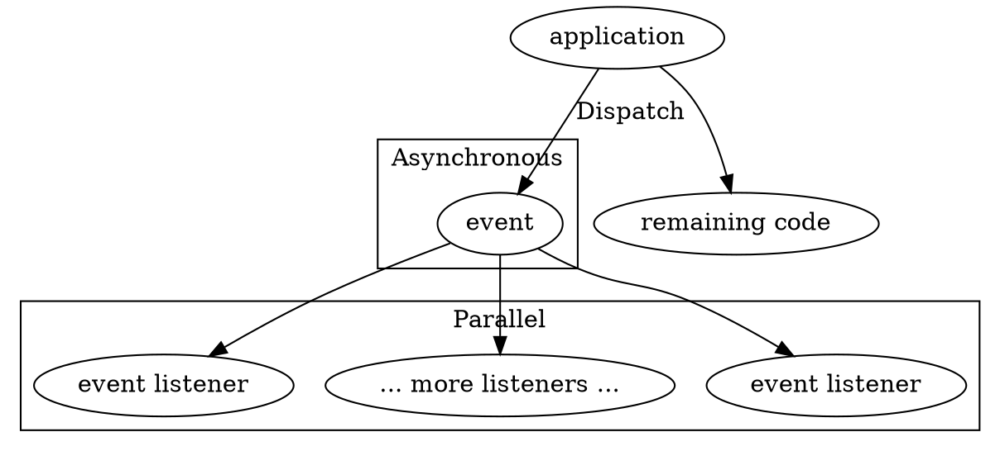
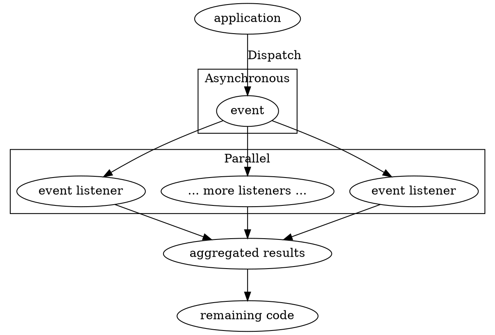

# Events

Events serve as notifications for various occurrences within your application, 
allowing you to subscribe to and react to them. 

They also facilitate the decoupling of different aspects of your application.

For example, you might want to trigger an event when an unhandled exception 
occurs and then create several listeners that report that exception to multiple 
services. Another scenario could involve triggering an event when a user 
authenticates and updates their last visit date asynchronously.

:::caution
Listeners lack fail-safe mechanisms, such as repeating events in case of 
failure. 

Therefore, you should not use them for critical actions. If you need to ensure 
that your event is processed reliably, consider using Message Brokers like 
RabbitMQ, Kafka, or SQS.
:::

# Usage

## Dispatching Events

### Asynchronously



If you don't need listener results and don't want to wait for them, you can 
dispatch the event in a coroutine and ignore its return value.

```php
<?php

/**
 * @var \Resonance\EventDispatcherInterface $eventDispatcher
 */
$eventDispatcher->dispatch(new MyEvent());
```

This is roughly equivalent to:

```php
<?php

use function Swoole\Coroutine\go;

go(function () use (&$eventDispatcher) {
    $eventDispatcher->collect(new MyEvent());
});
```

### Waiting for Listeners to Finish



By default, the Event Dispatcher executes all listeners asynchronously, but 
you can still wait for their returned values.

```php
<?php

$valuesReturnedByListeners = $eventDispatcher->collect(new MyEvent());

// Might only be PromiseState::Resolved or PromiseState::Rejected
$valuesReturnedByListeners->state;

// array (randomly ordered, since listeners are asynchronous) with results 
// returned from event listeners
$valuesReturnedByListeners->result; 
```

In this case, the Event Dispatcher executes listeners in parallel. The 
Event Dispatcher  will wait until all of them finish and then return a 
`SwooleFutureResult` with an unordered array of returned values.

For more information about Futures, see: {{docs/features/swoole-futures/index}}.

### Custom Events

Your event must implement the `Distantmagic\Resonance\EventInterface` 
interface. Then, the Event Dispatcher can use it alongside its
arbitrary data.

:::caution
If you want to dispatch events with either `Swoole\Http\Request` or 
`Swoole\Http\Response` object, you need to make sure that event listeners that 
listen to such events will *not* be executed after the request event loop, and
they will *not* create hard references to those requests, as it will lead to 
memory leaks. 

It is valid to use Request and Response objects in the events, but use them 
only if there is no other way to handle your use case.
:::

```php
use Distantmagic\Resonance\Attribute\ListensTo;
use Distantmagic\Resonance\EventInterface;
use Distantmagic\Resonance\EventListener;

// define the event
readonly class MyEvent implements EventInterface 
{
    public function __construct(public string $data) {}
}

// register the event listener
#[ListensTo(MyEvent::class)]
readonly class MyEventListener extends EventListener
{
    /**
     * @param MyEvent $event
     */
    public function handle(EventInterface $event): void
    {
        // ...
    }
}
```

## Registering Listeners

Event listeners must be singletons and belong to the Event Listener
collection. They muse also use the `ListensTo` attribute, specifying the 
event class they want to observe.

```php
<?php

namespace App\EventListener;

use Distantmagic\Resonance\Attribute\ListensTo;
use Distantmagic\Resonance\Attribute\Singleton;
use Distantmagic\Resonance\Event\SQLQueryBeforeExecute;
use Distantmagic\Resonance\EventInterface;
use Distantmagic\Resonance\EventListener;
use Distantmagic\Resonance\SingletonCollection;

/**
 * @template-extends EventListener<SQLQueryBeforeExecute,void>
 */
#[ListensTo(SQLQueryBeforeExecute::class)]
#[Singleton(collection: SingletonCollection::EventListener)]
final readonly class SQLQueryLogger extends EventListener
{
    /**
     * @param SQLQueryBeforeExecute $event
     */
    public function handle(EventInterface $event): void
    {
        // (...)
    }

    /**
     * This method is optional. You can decide here if this listener should be
     * registered at all.
     */
    public function shouldRegister(): bool
    {
        return /* decide if app is in development env */;
    }
}
```

### Listening to Multiple Events

If you want to reuse the same event listener for multiple events, you can 
repeat the `ListensTo` attribute:

```php
<?php

#[ListensTo(MyFirstEvent::class)]
#[ListensTo(MySecondEvent::class)]
#[Singleton(collection: SingletonCollection::EventListener)]
final readonly class MyListener extends EventListener
{
    /**
     * @param MyFirstEvent|MySecondEvent $event
     */
    public function handle(EventInterface $event): void
    {
        // (...)
    }
}
```

Since it has to be a singleton, in this case, one instance of the listener is 
going to be used for both events.

### Using Swoole Futures in Listeners

Listeners can return {{docs/features/swoole-futures/index}} in the `handle` 
method. It's going to be resolved by the Event Dispatcher.

Using `SwooleFuture` is a convenient wrapper that allows to execute the 
listener's contents asynchronously:

```php
<?php

use Distantmagic\Resonance\SwooleFuture;

#[ListensTo(MyFirstEvent::class)]
#[ListensTo(MySecondEvent::class)]
#[Singleton(collection: SingletonCollection::EventListener)]
final readonly class MyListener extends EventListener
{
    /**
     * @param MyFirstEvent|MySecondEvent $event
     */
    public function handle(EventInterface $event): SwooleFuture
    {
        return new SwooleFuture(function () use ($event) {
            // (...)
        });
    }
}
```

## Framework Events

Event | Description
-|-
`HttpServerStarted`     | Dispatched when the HTTP server has just started.
`SQLQueryBeforeExecute` | It is dispatched just before an SQL query is executed. It contains an `$sql` property with the query itself.
`UnhandledException`    | Dispatched when an exception is not caught in {{docs/features/http/responders}} or similar. You can use this event to attach your error reporters.
