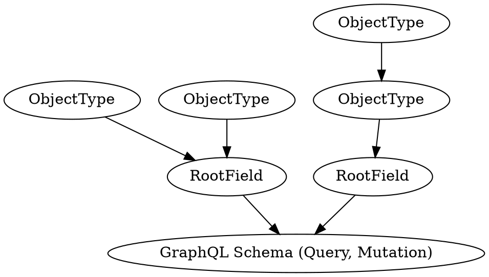

# Developing Schema

This framework adopts a code-first approach when constructing GraphQL schemas.

# Usage

## Exposing the GraphQL Endpoint

To expose the GraphQL API endpoint you need to use a custom 
{{docs/features/http/responders}} that forwards the request to the framewor's
GraphQL handler.

```php
<?php

namespace App\HttpResponder;

use Distantmagic\Resonance\Attribute\RespondsToHttp;
use Distantmagic\Resonance\Attribute\Singleton;
use Distantmagic\Resonance\HttpResponder;
use Distantmagic\Resonance\HttpResponder\GraphQL as ResonanceGraphQL;
use Distantmagic\Resonance\HttpResponderInterface;
use Distantmagic\Resonance\RequestMethod;
use Distantmagic\Resonance\SingletonCollection;
use Swoole\Http\Request;
use Swoole\Http\Response;
use App\HttpRouteSymbol;

#[RespondsToHttp(
    method: RequestMethod::POST,
    pattern: '/graphql',
    routeSymbol: HttpRouteSymbol::GraphQL,
)]
#[Singleton(collection: SingletonCollection::HttpResponder)]
final readonly class GraphQL extends HttpResponder
{
    public function __construct(private ResonanceGraphQL $graphql) {}

    public function respond(Request $request, Response $response): HttpResponderInterface
    {
        return $this->graphql;
    }
}
```

## Building GraphQL Root Query



To begin, prepare your root type class. It should be a singleton to ensure
that the framework does not recreate it during each request.

You can build the GraphQL schema by using annotations and cascading types.
Only `RootField` types are added directly into the GraphQL schema (either 
queries or mutations). `ObjectType` is used to extend the `RootField`.

:::tip
Since we are using singleton services, you do not need to implement
[lazy loading of types](https://webonyx.github.io/graphql-php/schema-definition/#lazy-loading-of-types).

The lazy-loading of types won't provide any performance or memory benefits when 
combined with this framework, as it already constructs everything during 
the application bootstrap phase.
:::

Let's start with an example type, `PingType`:

```php
<?php

use GraphQL\Type\Definition\ObjectType;
use GraphQL\Type\Definition\Type;

#[Singleton]
final class PingType extends ObjectType
{
    public function __construct()
    {
        parent::__construct([
            'name' => 'Ping',
            'fields' => [
                'message' => [
                    'type' => Type::string(),
                    'resolve' => $this->resolveMessage(...),
                ],
            ],
        ]);
    }

    private function resolveMessage(string $rootValue): string
    {
        return $rootValue;
    }
}

```

Next, create a provider that registers `PingType` as the GraphQL Schema's root 
query field:

:::note
You can use `GraphQLRootFieldType::Query` to register queries and 
`GraphQLRootFieldType::Mutation` for mutations.
:::

```php
<?php

use Distantmagic\Resonance\GraphQLFieldableInterface;
use Distantmagic\Resonance\GraphQLRootFieldType;

#[GraphQLRootField(
    name: 'ping',
    type: GraphQLRootFieldType::Query,
)]
#[Singleton(collection: SingletonCollection::GraphQLRootField)]
final readonly class Ping implements GraphQLFieldableInterface
{
    public function __construct(private PingType $pingType) {}

    public function resolve(): string
    {
        return 'pong';
    }

    public function toGraphQLField(): array
    {
        return [
            'type' => $this->pingType,
            'resolve' => $this->resolve(...),
        ];
    }
}
```

Now, you should be able to query your API. The following GraphQL query:

```graphql
query Ping() {
    ping {
        message
    }
}
```

Will yield this response:

```json
{
    "data": {
        "ping": {
            "message": "pong"
        }
    }
}
```


## Object Types

Object types should extend `GraphQL\Type\Definition\ObjectType`. First, they 
should be registered in the Root Field, then they should be nested inside
each other:

```php
<?php

declare(strict_types=1);

namespace App\ObjectType;

use Distantmagic\Resonance\Attribute\Singleton;
use GraphQL\Type\Definition\ObjectType;
use GraphQL\Type\Definition\Type;

#[Singleton]
final class PingType extends ObjectType
{
    public function __construct()
    {
        parent::__construct([
            'name' => 'Ping',
            'description' => 'Test field',
            'fields' => [
                'message' => [
                    'type' => Type::string(),
                    'description' => 'Always responds with pong',
                    'resolve' => $this->resolvePong(...),
                ],
            ],
        ]);
    }

    private function resolvePong(): string
    {
        return 'pong';
    }
}
```

# Promises in Resolvers

## GraphQL Resolvers

When working with GraphQL resolvers, it's a good practice to wrap asynchronous 
operations like database queries or API requests in a `SwooleFuture`:

```php
<?php

use GraphQL\Type\Definition\ObjectType;
use GraphQL\Type\Definition\Type;
use Distantmagic\Resonance\Attribute\Singleton;
use Distantmagic\Resonance\SwooleFuture;

#[Singleton]
final class PingType extends ObjectType
{
    public function __construct()
    {
        parent::__construct([
            'name' => 'Ping',
            'description' => 'Test field',
            'fields' => [
                'message' => [
                    'type' => Type::string(),
                    'description' => 'Always responds with pong',
                    'resolve' => $this->resolveMessage(...),
                ],
            ],
        ]);
    }

    private function resolveMessage(): SwooleFuture
    {
        return new SwooleFuture(function () {
            sleep(1);

            return 'pong';
        });
    }
}
```

By using `SwooleFuture`, you ensure the framework executes resolve callbacks in 
parallel. That significantly improves performance, especially when multiple 
resolvers are involved.

For example, the following GraphQL query will take around 1 second (instead of 
3 seconds) because resolvers are executed in parallel. 

```graphql
query MultiPing() {
    ping1: ping { message }
    ping2: ping { message }
    ping3: ping { message }
}
```
