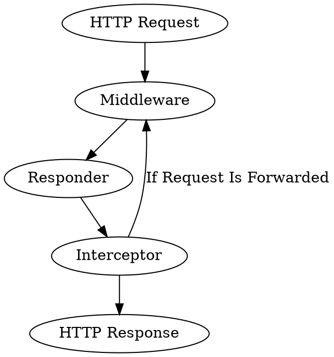

# HTTP

The HTTP stack is constructed atop Swoole's server, transforming the 
application into a long-running PHP process that handles multiple incoming HTTP 
requests. That diverges from the traditional PHP runtime model, which 
terminates scripts after servicing a single request.

Resonance offers a slight alternative to the 
conventional MVC model to harness this capability fully. Instead of creating 
controllers anew with each incoming request, we aim to maximize object reuse, 
minimizing response times, memory usage, and Garbage Collector overhead.

## Processing Stack

To process the HTTP request the only mandatory element is the Responder. 
Middlewares and Interceptors are optional components that handle the reusable
logic.

Requests can be recursively forwarded to and handled by different Responders
until the final HTTP Response is produced.

{{docs/features/http/*!docs/features/http/index}}
