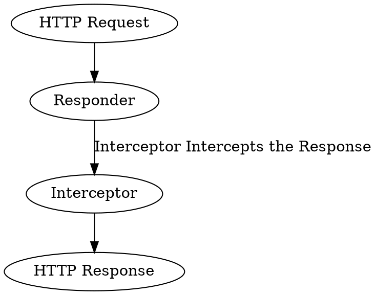
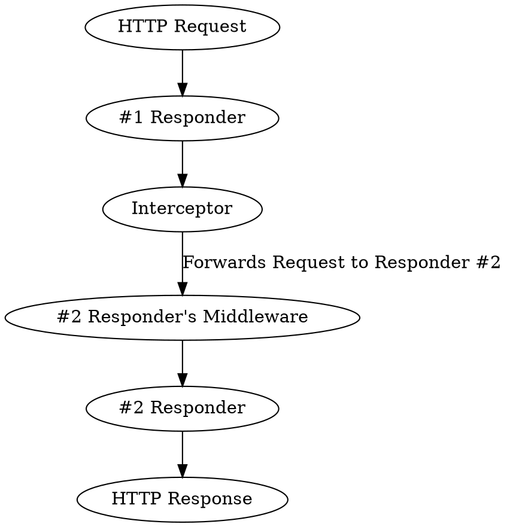

# Interceptors

Interceptors handle the opposite end of the request to the 
{{docs/features/http/middleware}}. They can convert arbitrary objects returned
from the {{docs/features/http/responders}} into a valid HTTP response.

They are singletons and allow easy decoupling of aspects of the application - 
since they can have their constructor dependencies which are no longer
necessary to inject into the {{docs/features/http/responders}}.



If Interceptors forward the response to another responder, then the entire 
middleware stack of that following responder is going to be executed also:



# Usage

Interceptors are able to capture any object that implements the 
`Distantmagic\Resonance\HttpInterceptableInterface`. You do not have to modify
the {{docs/features/http/responders}} or {{docs/features/http/controllers}} in
any way, you can just return the supported object. 

:::caution
If there is no interceptor implemented for the type of object you return, then
it's going to result in an error.
:::

## Built-In Interceptors

Captures | Produces
-|-
`Distantmagic\Resonance\InternalRedirect` | HTTP Redirect response
`Distantmagic\Resonance\JsonTemplate` | HTTP Response with `Content-Type: application/json` and stringified JSON data
`Distantmagic\Resonance\TwigTemplate` | HTTP Response with `Content-Type: text/html;charset=utf-8` and rendered {{docs/features/templating/twig/index}} Template

## Writing Interceptors

Interceptors need to have teh `#[Intercepts]` attribute and be registered
as a Singleton in the `HttpInterceptor` collection:

`#[Intercepts]` attribute tells which class it's supposed to intercept.

For example, let's create interceptable object first:

```php file:app/Hello.php
namespace App;

use Distantmagic\Resonance\HttpInterceptableInterface;

readonly class Hello implements HttpInterceptableInterface
{
    public function __construct(public string $message) {}
}
```

Then, the Interceptor that supports our object:

```php file:app/HttpInterceptor/HelloInterceptor.php
<?php

namespace App\HttpInterceptor;

use App\Hello;
use Distantmagic\Resonance\Attribute\Intercepts;
use Distantmagic\Resonance\Attribute\Singleton;
use Distantmagic\Resonance\ContentType;
use Distantmagic\Resonance\HttpInterceptableInterface;
use Distantmagic\Resonance\HttpInterceptor;
use Distantmagic\Resonance\HttpResponderInterface;
use Distantmagic\Resonance\SingletonCollection;
use Psr\Http\Message\ResponseInterface;
use Psr\Http\Message\ServerRequestInterface;

/**
 * @template-extends HttpInterceptor<Hello>
 */
#[Intercepts(Hello::class)]
#[Singleton(collection: SingletonCollection::HttpInterceptor)]
readonly class HelloInterceptor extends HttpInterceptor
{
    public function intercept(
        ServerRequestInterface $request,
        ResponseInterface $response,
        object $intercepted,
    ): HttpInterceptableInterface|HttpResponderInterface {
        return $response
            ->withHeader('content-type', 'text/plain')
            ->withBody($this->createStream('Hello, '.$intercepted->message.'!'))
        ;
    }
}
```

Now it's possible to use `Hello` as a responder response:

```php file:app/HttpResponder/HelloResponder
<?php

namespace App\HttpResponder;

use App\Hello;
use App\HttpRouteSymbol;
use Distantmagic\Resonance\Attribute\RespondsToHttp;
use Distantmagic\Resonance\Attribute\Singleton;
use Distantmagic\Resonance\HttpInterceptableInterface;
use Distantmagic\Resonance\HttpResponder;
use Distantmagic\Resonance\RequestMethod;
use Distantmagic\Resonance\SingletonCollection;
use Psr\Http\Message\ResponseInterface;
use Psr\Http\Message\ServerRequestInterface;

#[RespondsToHttp(
    method: RequestMethod::GET,
    pattern: '/hello',
    routeSymbol: HttpRouteSymbol::Hello,
)]
#[Singleton(collection: SingletonCollection::HttpResponder)]
final readonly class HelloResponder extends HttpResponder
{
    public function respond(ServerRequestInterface $request, ResponseInterface $response): HttpInterceptableInterface
    {
        return new Hello('World');
    }
}
```

The above responder is going to produce the `Hello, World!` HTTP Response.
