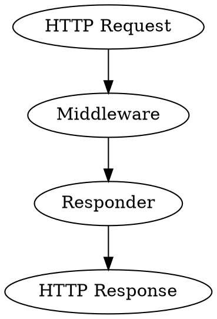
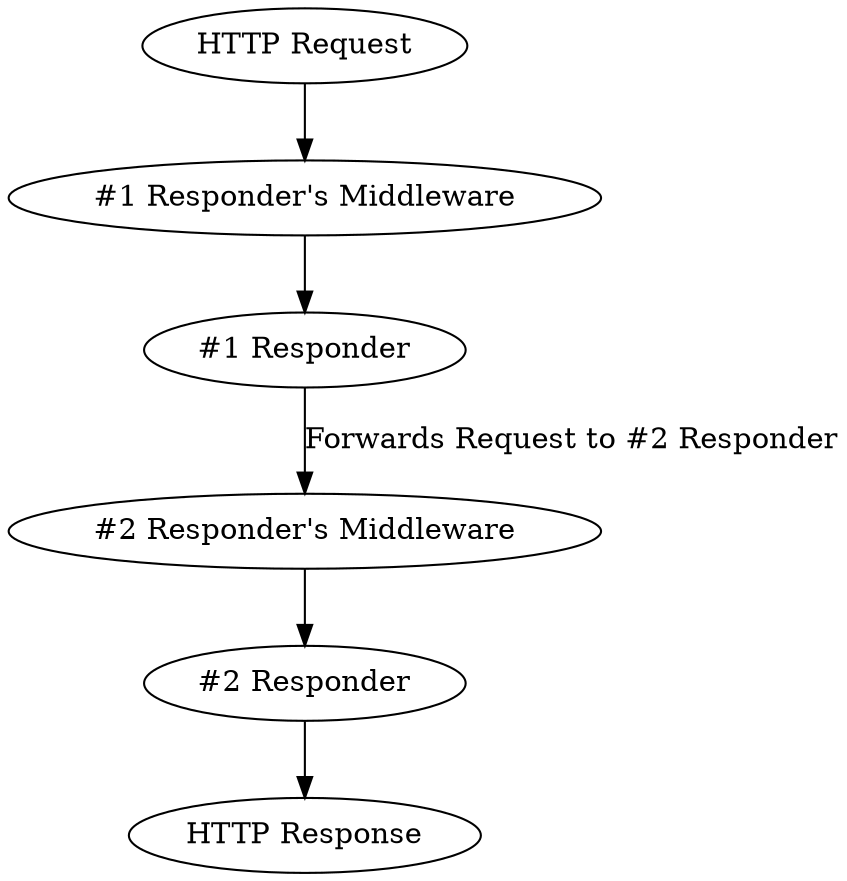

# Middleware

Middleware is a handler executed before the framework passes a request to its 
intended destination. You can use middlewares to verify CSRF tokens, check user 
permissions, and handle repeatable actions before the request reaches the 
{{docs/features/http/responders}}.

:::note
Resonance does *not* follow the [PSR Middleware](https://www.php-fig.org/psr/psr-15/).
We wanted to incorporate attributes to register middleware and expose those
attributes in the middleware handlers, which would require some severe 
workarounds to fit the PSR's middleware spec. 
:::



Resonance has a built-in way to forward HTTP requests. If the request is 
forwarded from one responder to another, the entire middleware stack on all 
responders in the chain are going to be executed.



# Usage

Middleware is attached to the {{docs/features/http/responders}} classes 
through an attribute.

There is no specific, universally used attribute that is dedicated to the 
middleware, instead, you can create a middleware handler that attaches itself 
to any attribute.

## Built-In Middleware

Resonance comes with several middleware handlers:

attribute | description
-|-
`Can` | Uses {{docs/features/security/authorization/index}} to check if user can perform a given Site Action before accesing the responder.
`ContentSecurityPolicy` | Sends selected {{docs/features/security/content-security-policy/index}} headers with the response.
`ValidatesCSRFToken` | Uses the {{docs/features/security/csrf-protection/index}} mechanisms to validate CSRF token.

You can add them to any HTTP Responder. For example:

```php
<?php

namespace App\HttpResponder;

// ...
use Distantmagic\Resonance\Attribute\ValidatesCSRFToken;
// ...

#[RespondsToHttp(
    method: RequestMethod::POST,
    pattern: '/blog/{blog_post_slug}/delete',
    routeSymbol: HttpRouteSymbol::BlogPostDestroy,
)]
#[Singleton(collection: SingletonCollection::HttpResponder)]
#[ValidatesCSRFToken('blog_post_destroy')]
final readonly class BlogPostDestroy extends HttpController
{
    public function createResponse(
        ServerRequestInterface $request,
        ResponseInterface $response,
        #[RouteParameter(from: 'blog_post_slug', intent: CrudAction::Delete)]
        BlogPost $blogPost,
    ): HttpInterceptableInterface {
        // ...

        return new InternalRedirect($request, $response, HttpRouteSymbol::Blog);
    }
}

```

## Writing Middleware

To register a custom middleware, you need to create the attribute that the
middleware attaches itself to the middleware handler.

### Attribute

It needs to extend the `Distantmagic\Resonance\Attribute` base class. Otherwise
it can accept any parameters:

```php
<?php

namespace App\Attribute;

use Attribute;
use Distantmagic\Resonance\Attribute as BaseAttribute;

#[Attribute(Attribute::TARGET_CLASS)]
final readonly class MyAttribute extends BaseAttribute {}
```

### Middleware Handler

To register a custom middleware, you need to:

1. use `#[HandlesMiddlewareAttribute]` annotation.
2. implement `HttpMiddlewareInterface` or extend `HttpMiddleware` class
3. register it as a singleton and add it to the `HttpMiddleware` collection

The preprocess method must forward the request to some HTTP responder (or use 
{{docs/features/http/interceptors}}). The framework passes the intended 
responder or interceptor as the `$next` parameter.

In this case, the `$attribute` parameter will be an instance of `MyAttribute`.

In the middleware, you can send the HTTP response, set HTTP headers, check the
 user's permissions, and do various other actions. If you return null, the 
 framework will not forward the request anywhere and will stop the processing 
 on the current middleware. You can also swap the intended responder with a 
 different responder.

```php
<?php

declare(strict_types=1);

namespace App\HttpMiddleware;

use App\Attribute\MyAttribute;
use Distantmagic\Resonance\Attribute;
use Distantmagic\Resonance\Attribute\HandlesMiddlewareAttribute;
use Distantmagic\Resonance\Attribute\Singleton;
use Distantmagic\Resonance\HttpInterceptableInterface;
use Distantmagic\Resonance\HttpMiddleware;
use Distantmagic\Resonance\HttpResponderInterface;
use Distantmagic\Resonance\SingletonCollection;
use Psr\Http\Message\ResponseInterface;
use Psr\Http\Message\ServerRequestInterface;

/**
 * @template-extends HttpMiddleware<MyAttribute>
 */
#[HandlesMiddlewareAttribute(
    attribute: MyAttribute::class,
    priority: 1000,
)]
#[Singleton(collection: SingletonCollection::HttpMiddleware)]
readonly class CanMiddleware extends HttpMiddleware
{
    public function preprocess(
        ServerRequestInterface $request,
        ResponseInterface $response,
        Attribute $attribute,
        HttpInterceptableInterface|HttpResponderInterface $next,
    ): HttpInterceptableInterface|HttpResponderInterface {
        return $next;
    }
}
```
