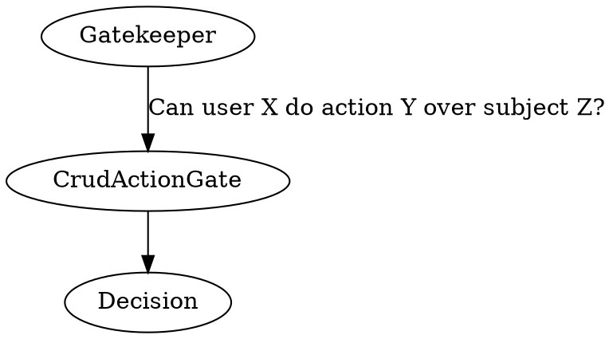
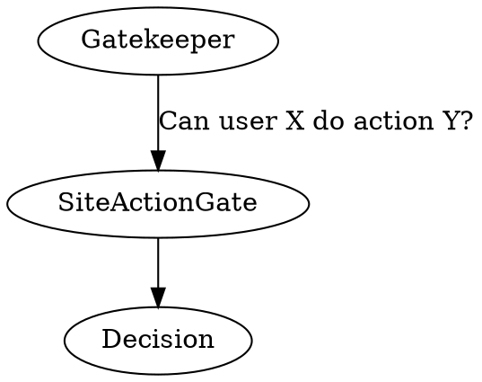

# Authorization

Authorization determines whether the currently authenticated user or any other 
actor can perform specific actions within your application. It's a crucial 
aspect of ensuring that your application operates securely and restricts access 
appropriately.

In many cases, you'll want to prevent unauthorized users from performing 
actions like creating, reading, updating, or deleting data.

# Usage

Authorization in this framework is managed through `CrudActionGate` (for CRUD 
operations - Create, Read, Update, Delete) and `SiteActionGate` objects. These 
gates should be registered using `DecidesCrudAction` and `DecidesSiteAction` 
attributes, respectively.

For CRUD actions, subjects should be tagged with the `CrudActionSubject` 
attribute.

:::note
While these authorization gates are essential for enabling some framework 
features, you can also implement additional authorization mechanisms on top of 
them or include them within your gates as needed.
:::

## Example CRUD Action Gate



Let's say you want to control access to blog posts. You can create a 
`BlogPostGate` to handle authorization logic:

```php
<?php

namespace App\CrudActionGate;

use App\BlogPostInterface;
use App\Role;
use Distantmagic\Resonance\Attribute\DecidesCrudAction;
use Distantmagic\Resonance\Attribute\Singleton;
use Distantmagic\Resonance\CrudAction;
use Distantmagic\Resonance\CrudActionGate;
use Distantmagic\Resonance\CrudActionSubjectInterface;
use Distantmagic\Resonance\SingletonCollection;
use Distantmagic\Resonance\UserInterface;

/**
 * @template-extends CrudActionGate<BlogPostInterface>
 */
#[DecidesCrudAction]
#[Singleton(collection: SingletonCollection::CrudActionGate)]
readonly class BlogPostGate extends CrudActionGate
{
    public function can(
        ?UserInterface $user,
        CrudActionSubjectInterface $subject,
        CrudAction $crudAction
    ): bool {
        return match ($crudAction) {
            CrudAction::Delete,
            CrudAction::Update => $this->isAdmin($user),
            CrudAction::Read => $subject->isPublished() || $this->isAdmin($user),
        };
    }

    public function isAdmin(?UserInterface $user): bool
    {
        return true === $user?->role->isAtLeast(Role::Admin);
    }
}
```

You can use `Gatekeeper` in your code to check permissions. For example:

:::tip
{{docs/features/http/controllers}} provide a convenient wrapper around 
`Gatekeeper` and `CrudActionGate`.
:::

```php
<?php

use App\BlogPostInterface;
use Distantmagic\Resonance\CrudAction;
use Distantmagic\Resonance\Gatekeeper;
use Swoole\Http\Request;

readonly class MyClass
{
    public function __construct(private Gatekeeper $gatekeeper) {}

    public function showBlogPost(
        Request $request,
        BlogPostInterface $blogPost,
    ): string
    {
        if (!$this->gatekeeper->withRequest($request)->canCrud($blogPost, CrudAction::Show)) {
            throw new RuntimeException('You cannot view this blog post');
        }

        return renderBlogPost($blogPost);
    }
}
```

## Example Site Action Gate



For site-wide actions, such as accessing an admin panel, you can create a 
`ShowAdminPanel` gate to control access based on user roles:

```php
<?php

namespace App\SiteActionGate;

use App\Role;
use App\SiteAction;
use Distantmagic\Resonance\Attribute\DecidesSiteAction;
use Distantmagic\Resonance\Attribute\Singleton;
use Distantmagic\Resonance\SingletonCollection;
use Distantmagic\Resonance\SiteActionGate;
use Distantmagic\Resonance\UserInterface;

#[DecidesSiteAction(SiteAction::ShowAdminPanel)]
#[Singleton(collection: SingletonCollection::SiteActionGate)]
final readonly class ShowAdminPanel extends SiteActionGate
{
    public function can(?UserInterface $user): bool
    {
        return true === $user?->role->isAtLeast(Role::Admin);
    }
}
```

You can then use this site action gate with `Gatekeeper` as follows:

```php
<?php

$gatekeeper->withRequest($request)->can(SiteAction::ShowAdminPanel);
```

Additionally, you can use Site Actions with {{docs/features/http/responders}} 
by applying the `Can` attribute to your responder:

```php
<?php

#[Can(SiteAction::ShowAdminPanel)]
final readonly class MyResponder implements HttpResponderInterface
{
    // (...)
}
```

This enables you to control access to specific responders based on your 
authorization logic.
