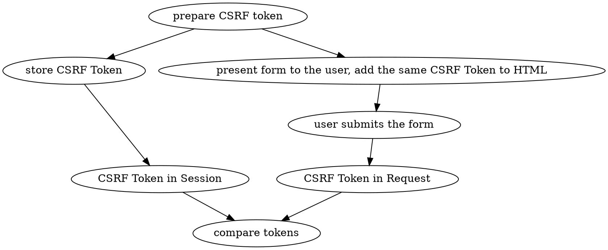

# CSRF Protection

> CSRF (Cross-Site Request Forgery) is an attack that impersonates a trusted 
> user and sends a website unwanted commands.
> 
> [MDN](https://developer.mozilla.org/en-US/docs/Glossary/CSRF)

CSRF (Cross-Site Request Forgery) protection relies on 
{{docs/features/http/sessions}}, so you should make sure you understand how to
use those first.

:::tip
**Besides** the CSRF protection, it's a good idea to protect your site by 
setting
{{docs/features/security/content-security-policy/index}} wherever they may be 
applied.
:::

## HTML Forms



Since Resonance has stateful features (you can persist some data related to
the current client session on the server), for HTML forms, it follows the
[Synchronizer Token Pattern](https://cheatsheetseries.owasp.org/cheatsheets/Cross-Site_Request_Forgery_Prevention_Cheat_Sheet.html#synchronizer-token-pattern).

That means that to protect your forms from CSRF, it is necessary to:

1. Set the CSRF token in the current HTTP Session
2. Send that CSRF token with the HTML form back to the client
3. After the user submits the form, make sure that the token sent with the form is
   the same as the token stored in the session

That ensures that the user saw your form before submitting it and
it was submitted directly on your website and not from another 
website. The framework handles those actions by using the CSRF Manager.

## Using CSRF Protection Manager

:::note
In this documentation, we use plain PHP templates to demonstrate features.

However, you can utilize these techniques with any templating library of your 
choice.
:::

First, you have to set the CSRF token in your HTML template:

```php-template
<html>
    <body>
        <form method="post">
            <input type="hidden" value="<?= $csrfManager->prepareSessionToken($request, 'my_token') ?>">

            <textarea name="example">Some example form data</textarea>

            <button type="submit">Submit</button>
        </form>
    </body>
</html>
```

Then, in your {{docs/features/http/responders}}, you need to validate the token.
You can do this either manually or using the `ValidatesCSRFToken` annotation.

### Validating the CSRF Token Using Annotation

If the token is invalid, Resonance is going to return an HTTP 400 (bad request) 
response and the `respond` method will not be called.

```php
<?php

use Distantmagic\Resonance\Attribute\Singleton;
use Distantmagic\Resonance\Attribute\ValidatesCSRFToken;
use Distantmagic\Resonance\HttpResponderInterface;
use Psr\Http\Message\ResponseInterface;
use Psr\Http\Message\ServerRequestInterface;

#[Singleton]
#[ValidatesCSRFToken('my_token')]
final readonly class MyResponder implements HttpResponderInterface
{
    public function respond(ServerRequestInterface $request, ResponseInterfaced $response): void 
    {
        // CSRF token is valid...
    }
}
```

### Validating the CSRF Token Manually

```php
<?php

use Distantmagic\Resonance\Attribute\Singleton;
use Distantmagic\Resonance\CSRFManager;
use Distantmagic\Resonance\HttpResponder;
use Psr\Http\Message\ResponseInterface;
use Psr\Http\Message\ServerRequestInterface;

#[Singleton]
final readonly class MyResponder extends HttpResponder
{
    public function __construct(private CSRFManager $csrfManager) 
    {
    }

    public function respond(ServerRequestInterface $request, ResponseInterface $response): ResponseInterface
    {
        if (!$this->csrfManager->checkToken($request, $request->getParsedBody())) {
            return $response
                ->withStatus(400)
                ->withBody($this->createStream('Bad Request: CSRF Token is invalid.'))
            ;
        }

        // CSRF token is valid...
    }
}
```

