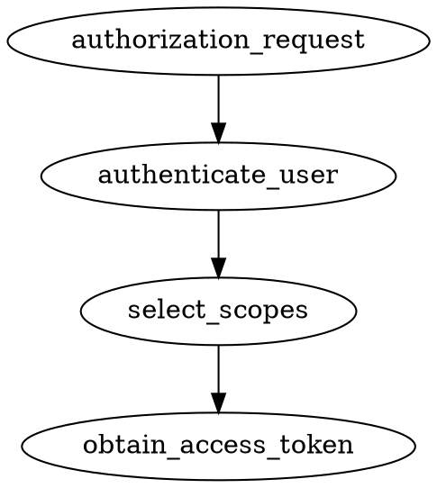

# Authorization Code Grant

Authorization Code Grant needs an additional auth step compared to other types
of grants (exchanging auth code), thus it's explained here in more detail than
other grant types.

# Usage

You need to complete {{docs/features/security/oauth2/installation}}, 
{{docs/features/security/oauth2/configuration}} first.

You also need to implement all the required repositories (see more at: 
{{docs/features/security/oauth2/enabling-grants}}).

Next, go through this document step-by-step.

## Enable Authorization Code Grant

First, you need to register Authorization Code Grant in your application:

```php file:app/OAuth2GrantProvider/AuthCodeGrantProvider.php
<?php

namespace App\OAuth2GrantProvider;

use DateInterval;
use Distantmagic\Resonance\Attribute\ProvidesOAuth2Grant;
use Distantmagic\Resonance\Attribute\Singleton;
use Distantmagic\Resonance\OAuth2GrantProvider;
use Distantmagic\Resonance\SingletonCollection;
use League\OAuth2\Server\Grant\AuthCodeGrant;
use League\OAuth2\Server\Grant\GrantTypeInterface;
use League\OAuth2\Server\Repositories\AuthCodeRepositoryInterface;
use League\OAuth2\Server\Repositories\RefreshTokenRepositoryInterface;

#[ProvidesOAuth2Grant]
#[Singleton(collection: SingletonCollection::OAuth2Grant)]
readonly class AuthCodeGrantProvider extends OAuth2GrantProvider
{
    public function __construct(
        private AuthCodeRepositoryInterface $authCodeRepository,
        private RefreshTokenRepositoryInterface $refreshTokenRepository,
    )
    {
    }

    public function getGrant(): GrantTypeInterface
    {
        return new AuthCodeGrant(
            $this->authCodeRepository,
            $this->refreshTokenRepository,
            new DateInterval('PT1M'),
        );
    }
}
```

## Expose Authorization Endpoint

You also need to create a custom authorization server endpoint (to perform auth 
code exchange). This step is not required by other grants.

```php file:app/HttpResponder/OAuth2AuthorizationServer.php
<?php

namespace App\HttpResponder;

use App\HttpRouteSymbol;
use Distantmagic\Resonance\Attribute\RespondsToHttp;
use Distantmagic\Resonance\Attribute\Singleton;
use Distantmagic\Resonance\HttpResponder;
use Distantmagic\Resonance\HttpResponder\OAuth2\Authorization;
use Distantmagic\Resonance\HttpResponderInterface;
use Distantmagic\Resonance\RequestMethod;
use Distantmagic\Resonance\SingletonCollection;
use Swoole\Http\Request;
use Swoole\Http\Response;

#[RespondsToHttp(
    method: RequestMethod::POST,
    pattern: '/oauth2/authorization',
    routeSymbol: HttpRouteSymbol::OAuth2AuthorizationServer,
)]
#[Singleton(collection: SingletonCollection::HttpResponder)]
final readonly class OAuth2AuthorizationServer extends HttpResponder
{
    public function __construct(private Authorization $authorizationServer) {}

    public function respond(Request $request, Response $response): HttpResponderInterface
    {
        return $this->authorizationServer;
    }
}
```

## Implement Authorization Code Grant Controller

While the `Authorization` server handles the rough edges, you still need to 
implement some features that are specific to your application.

This is the part in which you want to implement some extra features, like 
login/password authentication or 2FA.


