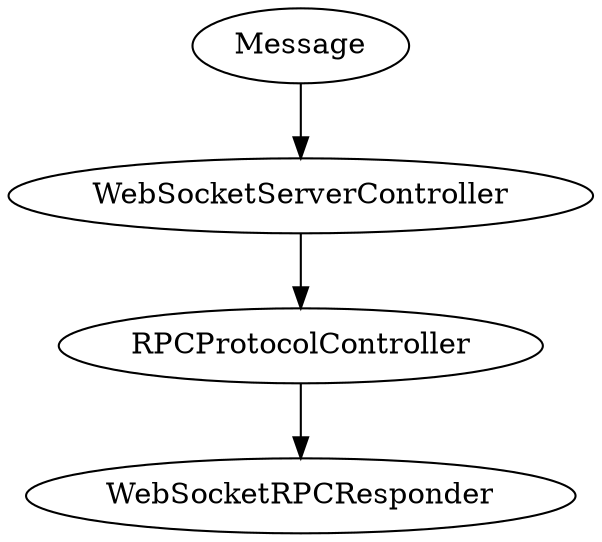

# Protocols

## RPC



### Establishing the Connection

```typescript
const webSocket = new WebSocket('wss://localhost:9501', ['dm-rpc']);
```

### Writing RPC Responders

```php
<?php

namespace App\WebSocketRPCResponder;

use App\RPCMethod;
use Distantmagic\Resonance\Attribute\RespondsToWebSocketRPC;
use Distantmagic\Resonance\Attribute\Singleton;
use Distantmagic\Resonance\RPCRequest;
use Distantmagic\Resonance\RPCResponse;
use Distantmagic\Resonance\SingletonCollection;
use Distantmagic\Resonance\WebSocketAuthResolution;
use Distantmagic\Resonance\WebSocketConnection;
use Distantmagic\Resonance\WebSocketRPCResponder;

#[RespondsToWebSocketRPC(RPCMethod::Echo)]
#[Singleton(collection: SingletonCollection::WebSocketRPCResponder)]
final readonly class EchoResponder extends WebSocketRPCResponder
{
    protected function onRequest(
        WebSocketAuthResolution $webSocketAuthResolution,
        WebSocketConnection $webSocketConnection,
        RPCRequest $rpcRequest,
    ): void {
        $webSocketConnection->push(new RPCResponse(
            $rpcRequest->requestId,
            (string) $rpcRequest->payload,
        ));
    }
}
```
