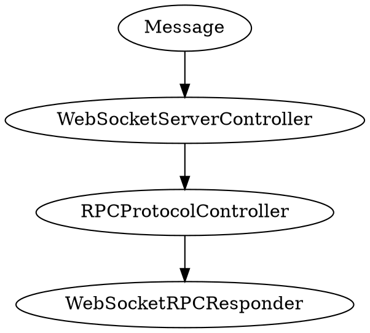

# Protocols

## RPC



### Establishing the Connection

Besides connecting to the server and choosing a protocol, you also have to
add {{docs/features/security/csrf-protection/index}} token. Since we cannot
use `POST` to establish connection, we need to add it as a `GET` variable.

```typescript
const serverUrl = new URL('wss://localhost:9501');

serverUrl.searchParams.append('csrf', /* obtain CSRF token */);

const webSocket = new WebSocket(serverUrl, ['dm-rpc']);
```

For example, if you are using {{docs/features/templating/twig/index}}, you can
put CSRF token into a meta tag:

```twig
<meta name="csrf-token" content="{{ csrf_token(request, response) }}">
```

Then, in JavaScript:

```typescript
serverUrl.searchParams.append(
    'csrf', 
    document.querySelector("meta[name=csrf-token]").attributes.content.value,
);
```

### Writing RPC Responders

```php
<?php

namespace App\WebSocketRPCResponder;

use App\RPCMethod;
use Distantmagic\Resonance\Attribute\RespondsToWebSocketRPC;
use Distantmagic\Resonance\Attribute\Singleton;
use Distantmagic\Resonance\Attribute\WantsFeature;
use Distantmagic\Resonance\Feature;
use Distantmagic\Resonance\Constraint;
use Distantmagic\Resonance\Constraint\StringConstraint;
use Distantmagic\Resonance\RPCRequest;
use Distantmagic\Resonance\RPCResponse;
use Distantmagic\Resonance\SingletonCollection;
use Distantmagic\Resonance\WebSocketAuthResolution;
use Distantmagic\Resonance\WebSocketConnection;
use Distantmagic\Resonance\WebSocketRPCResponder;

#[RespondsToWebSocketRPC(RPCMethod::Echo)]
#[Singleton(collection: SingletonCollection::WebSocketRPCResponder)]
#[WantsFeature(Feature::WebSocket)]
final readonly class EchoResponder extends WebSocketRPCResponder
{
    public function getConstraint(): Constraint
    {
        return new StringConstraint();
    }

    public function onRequest(
        WebSocketAuthResolution $webSocketAuthResolution,
        WebSocketConnection $webSocketConnection,
        RPCRequest $rpcRequest,
    ): void {
        $webSocketConnection->push(new RPCResponse(
            $rpcRequest->requestId,
            $rpcRequest->payload,
        ));
    }
}
```

### RPC Connection Controller (Optional)

In case you want not only respond to RPC messages, but also be able to push
notifications to the client at any moment, you can implement 
`Distantmagic\Resonance\WebSocketRPCConnectionControllerInterface` and 
register in in the {{docs/features/dependency-injection/index}} container.

For example:

```php file:app/WebSocketRPCConnectionController.php
<?php

namespace App;

use Distantmagic\Resonance\Attribute\Singleton;
use Distantmagic\Resonance\Attribute\WantsFeature;
use Distantmagic\Resonance\Feature;
use Distantmagic\Resonance\RPCNotification;
use Distantmagic\Resonance\WebSocketAuthResolution;
use Distantmagic\Resonance\WebSocketConnection;
use Distantmagic\Resonance\WebSocketRPCConnectionControllerInterface;

#[Singleton(provides: WebSocketRPCConnectionControllerInterface::class)]
#[WantsFeature(Feature::WebSocket)]
readonly class WebSocketRPCConnectionController implements WebSocketRPCConnectionControllerInterface
{
    public function onClose(
        WebSocketAuthResolution $webSocketAuthResolution,
        WebSocketConnection $webSocketConnection,
    ): void {
        // called when connection is closed
    }

    public function onOpen(
        WebSocketAuthResolution $webSocketAuthResolution,
        WebSocketConnection $webSocketConnection,
    ): void
    {
        if ($webSocketConnection->status === WebSocketConnectionStatus::Closed) {
            // connection is closed
        }

        $webSocketConnection->push(new RPCNotification(
            RPCMethod::YourMethod,
            [
                // your payload
            ]
        ));
    }
}
```
