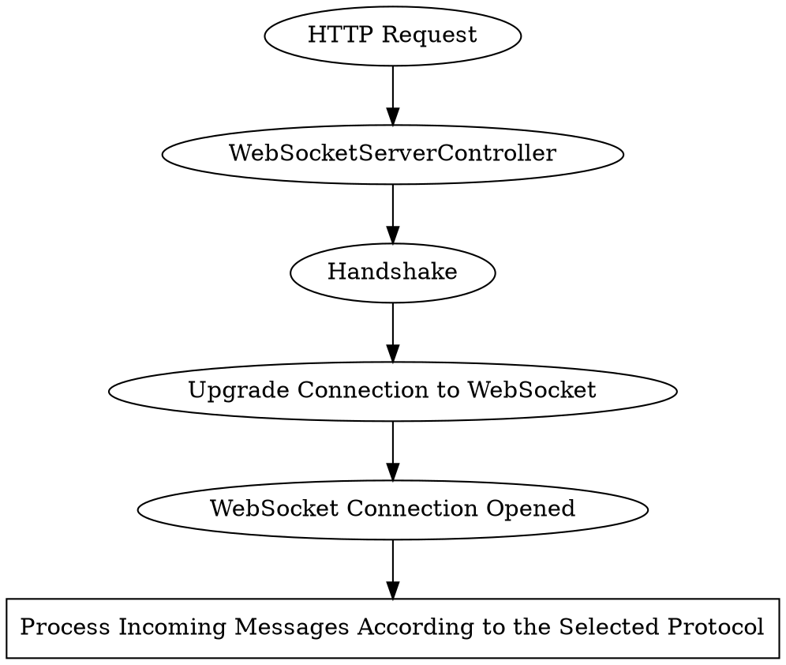

# Server

By default, the WebSockets server listens to the same port as 
HTTP {{docs/features/http/server}} since {{docs/features/websockets/index}} 
connections are established by upgrading the HTTP connections.

There is no reason *not* to start separate WebSockets and HTTP servers. 
However, they cannot share the same port if they are separated.

# Usage

## Setting up the Bootstrap

## Establishing the Connection

:::caution
To establish the connection, selecting the WebSocket protocol 
([subprotocol](https://datatracker.ietf.org/doc/html/rfc6455#page-12)) is 
mandatory.

Protocol instructs the server how to respond to incoming messages and what 
types of messages to accept.

Resonance is bundled with some basic 
{{docs/features/websockets/protocols}}.
:::

