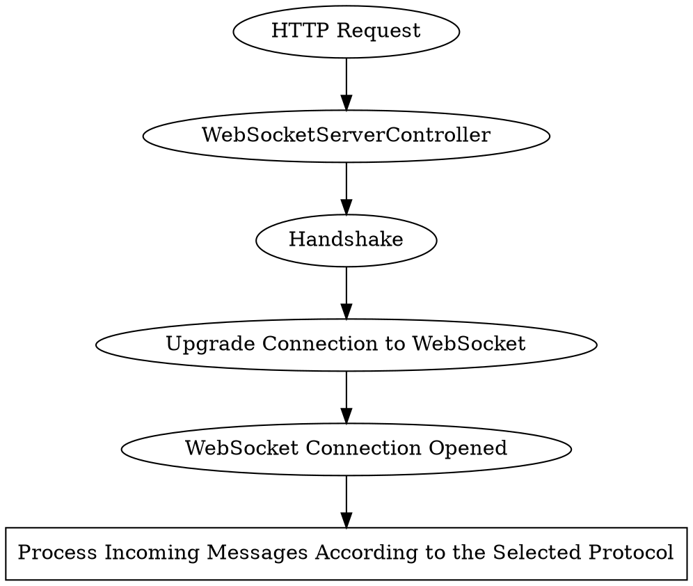

# Server

By default, the WebSockets server listens to the same port as 
HTTP {{docs/features/http/server}} since {{docs/features/websockets/index}} 
connections are established by upgrading the HTTP connections.

There is no reason *not* to start separate WebSockets and HTTP servers. 
However, they cannot share the same port if they are separated.

# Usage

## Setting up the Bootstrap



```php
<?php

declare(strict_types=1);

namespace App\Commands;

use App\SwooleConfiguration;
use Distantmagic\Resonance\ApplicationConfiguration;
use Distantmagic\Resonance\Attribute\ConsoleCommand;
use Distantmagic\Resonance\Command;
use Distantmagic\Resonance\Environment;
use Distantmagic\Resonance\Event\HttpServerStarted;
use Distantmagic\Resonance\EventDispatcherInterface;
use Distantmagic\Resonance\HttpResponderAggregate;
use Distantmagic\Resonance\WebSocketServerController;
use Psr\Log\LoggerInterface;
use Swoole\Http\Request;
use Swoole\Http\Response;
use Swoole\WebSocket\Server;
use Symfony\Component\Console\Input\InputInterface;
use Symfony\Component\Console\Output\OutputInterface;

#[ConsoleCommand(name: 'serve')]
final class Serve extends Command
{
    public function __construct(
        private ApplicationConfiguration $applicationConfiguration,
        private EventDispatcherInterface $eventDispatcher,
        private LoggerInterface $logger,
        private SwooleConfiguration $swooleConfiguration,
        private WebSocketServerController $webSocketServerController,
    ) {
        parent::__construct();
    }

    protected function execute(InputInterface $input, OutputInterface $output): int
    {
        $server = new Server(
            $this->swooleConfiguration->host,
            $this->swooleConfiguration->port,
            SWOOLE_PROCESS,
            SWOOLE_SOCK_TCP | SWOOLE_SSL,
        );

        $server->set([
            'enable_coroutine' => true,
            'enable_deadlock_check' => Environment::Development === $this->applicationConfiguration->environment,
            'log_level' => $this->swooleConfiguration->logLevel,
            'ssl_cert_file' => DM_ROOT.'/'.$this->swooleConfiguration->sslCertFile,
            'ssl_key_file' => DM_ROOT.'/'.$this->swooleConfiguration->sslKeyFile,
            'open_http2_protocol' => true,
        ]);

        $server->on('start', function () {
            $this->eventDispatcher->dispatch(new HttpServerStarted());

            $this->logger->info('WebSocket server is listening at wss://'.$this->swooleConfiguration->host.':'.$this->swooleConfiguration->port);
        });

        $server->on('close', $this->webSocketServerController->onClose(...));
        $server->on('message', $this->webSocketServerController->onMessage(...));
        $server->on('open', $this->webSocketServerController->onOpen(...));
        $server->on(
            'handshake',
            function (Request $request, Response $response) use ($server) {
                $this->webSocketServerController->onHandshake($server, $request, $response);
            }
        );

        return (int) !$server->start();
    }
}
```

## Establishing the Connection

:::caution
To establish the connection, selecting the WebSocket protocol 
([subprotocol](https://datatracker.ietf.org/doc/html/rfc6455#page-12)) is 
mandatory.

Protocol instructs the server how to respond to incoming messages and what 
types of messages to accept.

Resonance is bundled with some basic 
{{docs/features/websockets/protocols}}.
:::

