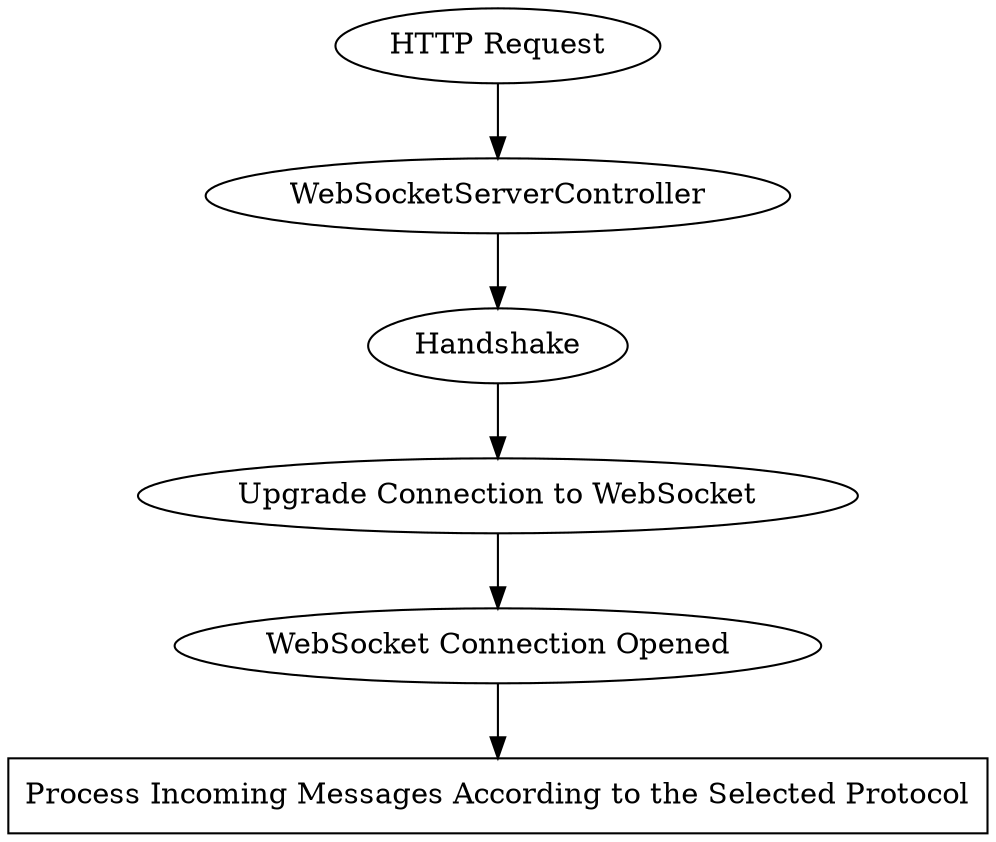

# Server

By default, the WebSockets server listens to the same port as 
HTTP {{docs/features/http/server}} since {{docs/features/websockets/index}} 
connections are established by upgrading the HTTP connections.

There is no reason *not* to start separate WebSockets and HTTP servers. 
However, they cannot share the same port if they are separated.

# Usage

## Enabling the Server

To enable WebSocket server you need to provide the 
`JsonRPCMethodValidatorInterface`. For example:

```php file:app\JsonRPCMethod.php
<?php

namespace App;

use Distantmagic\Resonance\EnumValuesTrait;
use Distantmagic\Resonance\JsonRPCMethodInterface;
use Distantmagic\Resonance\NameableEnumTrait;

enum JsonRPCMethod: string implements JsonRPCMethodInterface
{
    use EnumValuesTrait;
    use NameableEnumTrait;

    case Echo = 'echo';
}
```

:::note
Do not forget about `#[WantsFeature(Feature::WebSocket)` attribute. If added to 
any singleton, it tells Resonance to enable the WebSocket server.
:::

```php file:app\JsonRPCMethodValidator.php
<?php

namespace App;

use Distantmagic\Resonance\Attribute\Singleton;
use Distantmagic\Resonance\Attribute\WantsFeature;
use Distantmagic\Resonance\Feature;
use Distantmagic\Resonance\JsonRPCMethodInterface;
use Distantmagic\Resonance\JsonRPCMethodValidatorInterface;

#[Singleton(provides: JsonRPCMethodValidatorInterface::class)]
#[WantsFeature(Feature::WebSocket)]
readonly class JsonRPCMethodValidator implements JsonRPCMethodValidatorInterface
{
    public function cases(): array
    {
        return JsonRPCMethod::cases();
    }

    public function castToRPCMethod(string $methodName): JsonRPCMethodInterface
    {
        return JsonRPCMethod::from($methodName);
    }

    public function names(): array
    {
        $ret = [];

        foreach ($this->cases() as $case) {
            array_push($ret, $case->getName());
        }

        return $ret;
    }
}
```

## Setting up the Bootstrap



## Establishing the Connection

:::caution
To establish the connection, selecting the WebSocket protocol 
([subprotocol](https://datatracker.ietf.org/doc/html/rfc6455#page-12)) is 
mandatory.

Protocol instructs the server how to respond to incoming messages and what 
types of messages to accept.

Resonance is bundled with some basic 
{{docs/features/websockets/protocols}}.
:::

