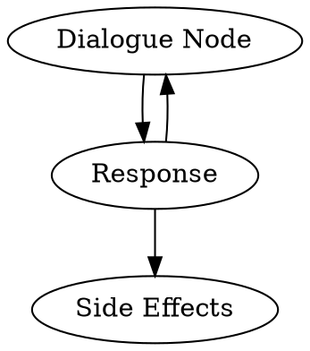

## What Are Conversational Applications?

Conversational applications are more than just chatbots. Large Language Models, 
when used as a user interface, enables users to create advanced applications that 
can replace most of the traditional interfaces.

They can use LLM (Large Language Models) or other means of processing
human input as a front-end. The simplest example is a custom GPT that can use
your API to interact with your application.

Is it a silver bullet to solve all the problems? Of course not. Currently most 
of AI integrations act as copilots or assistants. What if we try to 
inverse that dynamic where CUI (Conversational User Interface) is an add-on to 
the Graphical User Interface and make GUI components a complimentary feature 
instead?

### How It Started

Ok, maybe [Zork](https://en.wikipedia.org/wiki/Zork) is not really a 
conversational application, but it is really symbolic for me. 

All the interactions with the game are done through a series of specific 
commands. That kind of interface is rigorous in its usage because 
although it theoretically allows us to input any text, we still have to
guess our options.

It is strict both on input and output data with no room for interpretation -
like using some scripting programming language.


*image source: [lemon64](https://www.lemon64.com/game/zork-1-golden-edition)*

### How Is It Going

Several observations:

1. We have an AI that can recreate the Zork experience in seconds without 
    requiring almost any human labor.
2. AI understands any input that we can throw at it.
3. AI responds in the style and tone we asked, making the experience 
    uniquely personalized.

Now, we can create a conversational application that can
understand any input and provide a unique experience for 
each user. It is, however, very general in its use cases - which is both a 
blessing and a curse in disguise (see: 
[infamous Chevrolet chatbot incident](https://www.reddit.com/r/ChatGPT/comments/18kvlzc/i_gaslit_the_chevrolet_support_bot_into_thinking/)).


*image source: [ChatGPT](https://chat.openai.com/)*

### Where Is It Going?

What if we could mold a general-use AI to fit our specific applications and use
cases while benefiting from its reasoning and language capabilities? To
be flexible when accepting inputs and simultaneously avoiding hallucinations.
How about building the applications themselves without writing code?

## Semi-Scripted Dialogues

Let us meet the AI halfway. We will create a semi-scripted dialogue to list 
predefined dialogue nodes and potential responses. The system will accept any 
input and try to match it with one of the predefined responses. This allows us 
flexibility when accepting inputs and be strict and predictable about our 
outputs.

### Ingredients

1. [Swoole](https://swoole.com/)
1. {{docs/features/ai/server/llama-cpp/extractors/index}} 
    (to interpret the user's input and allow the AI to make further decisions based
    on it)
1. {{docs/features/conversational-applications/dialogue-nodes/index}}
    (to create a conversational flow)
1. {{docs/features/websockets/index}} (to actually serve the application)

### What Are We Going to Build?

We will create a simple CRUD task management system. User will be able to name 
a new task, add a description, and list available tasks through a conversational
interface.

We are going to use an LLM (through {{docs/features/ai/server/llama-cpp/index}})
to match user inputs with specific conversational nodes.

The application itself will alternate between handling potential responses from
the user and executing side effects.



We will model the following conversation in a semi-scripted way so it will be
capable of handling pretty much any user input:

```
System: 
    Message: Hello! How can I help you with your tasks?
    Potential Responses:
        - I want to create a task
        - I want to list all my tasks.
```

You can serve it in any way, either as a standalone application, a 
[Telegram](https://telegram.org/) bot or a web application. We will focus on 
the core of the conversational application and skip the delivery method for 
now.

### Dialogue Controllers

We are all familiar with HTTP {{docs/features/http/controllers}} who mediate
between the user and the application. Why don't we reuse a similar concept and
create a dialogue controller?

It should keep the general state of the conversation and be able to react to
user requests.

First, let us define the initial dialogue node and all the potential responses:

```php file:app/DialogueCOntroller/TaskConversationController.php
#[Singleton]
readonly class TaskConversationController extends DialogueController
{
    private DialogueNodeInterface $rootNode;

    public function __construct(
        private DoctrineEntityManagerRepository $doctrineEntityManagerRepository,
        private HelpfulAssistant $helpfulAssistantPersona,
        private LlamaCppClientInterface $llamaCppClient,
        LlamaCppExtractWhenInterface $llamaCppExtractWhen,
        private LlamaCppExtractSubject $llamaCppExtractSubject,
    ) {
        $this->rootNode = DialogueNode::withMessage('Hello! How can I help you with your tasks?');
        $this->rootNode->addPotentialResponse(new CatchAllResponse(
            followUp: $this->welcomeNode,
        ));

        $this->welcomeNode->addPotentialResponse(new LlamaCppExtractWhenResponse(
            llamaCppExtractWhen: $llamaCppExtractWhen,
            condition: 'User wants to create a new task',
            persona: $helpfulAssistantPersona,
            whenProvided: $this->whenUserWantsToCreateTask(...)
        ));

        $this->welcomeNode->addPotentialResponse(new LlamaCppExtractWhenResponse(
            llamaCppExtractWhen: $llamaCppExtractWhen,
            condition: 'User wants to list all their tasks',
            persona: $helpfulAssistantPersona,
            whenProvided: $this->whenUserWantsToListAllTasks(...)
        ));
    }

    public function getRootDialogueNode(): DialogueNodeInterface
    {
        return $this->rootNode;
    }

// (...)
```

Now, we need to handle all the predefined responses. Let's start with the 
one to create a new task. Let us try to extract the task name. If that is
successful, let us move forward and add the task; in any other case, ask the 
user to specify further:

```php file:app/DialogueCOntroller/TaskConversationController.php
// (...)

    private function whenUserWantsToCreateTask(LlamaCppExtractWhenResult $response): Generator
    {
        if ($response->result->isNo()) {
            return DialogueResponseResolution::cannotRespond();
        }

        $result = $this->llamaCppExtractSubject->extract(
            input: $response->input,
            topic: 'task name',
        );

        //user provided a name of the task
        if ($result->content) {
            $followUp->addSideEffect(new CreateTask(
                taskName: $result->content,
            ));

            $followUp = new DialogueNode(new LlamaCppPromptMessageProducer(
                llamaCppClient: $this->llamaCppClient,
                request: new LlamaCppCompletionRequest(
                    llmChatHistory: new LlmChatHistory([
                        new LlmChatMessage(
                            actor: 'system',
                            message: 'Let user know that their task is added',
                        ),
                    ]),
                ),
            ));
        } else {
            $followUp = new DialogueNode(new LlamaCppPromptMessageProducer(
                llamaCppClient: $this->llamaCppClient,
                request: new LlamaCppCompletionRequest(
                    llmChatHistory: new LlmChatHistory([
                        new LlmChatMessage(
                            actor: 'system',
                            message: 'Ask user to specify the name of the task',
                        ),
                    ]),
                ),
            ));
        }

        // Go back to the primary dialogue node in any case
        $followUp->copyResponsesFrom($this->rootNode);

        return DialogueResponseResolution::canRespond($followUp);
    }

// (...)
```

When a user wants to list all tasks, just produce a response in a similar way
you would produce an HTML view:

```php file:app/DialogueCOntroller/TaskConversationController.php
// (...)

    private function whenUserWantsToCreateTask(LlamaCppExtractWhenResult $response): Generator
    {
        if ($response->result->isNo()) {
            return DialogueResponseResolution::cannotRespond();
        }

        $responseMessage = "Your tasks:\n%s";

        $tasks = $this
            ->doctrineEntityManagerRepository
            ->withEntityManager(function (EntityManagerInterface $entityManager) {
                // ...obtain user tasks somehow
            })
        ;

        foreach ($tasks as $task) {
            $responseMessage .= "- {$task->name}\n";
        }

        $followUp = DialogueNode::withMessage($responseMessage);

        // Go back to the primary dialogue node in any case
        $followUp->copyResponsesFrom($this->rootNode);

        return DialogueResponseResolution::canRespond($followUp);
    }
}
```

## Summary

It was a simple example of a conversational application; it's like writing a 
basic "Hello, world!". I hope it inspires you to create something incredible!
